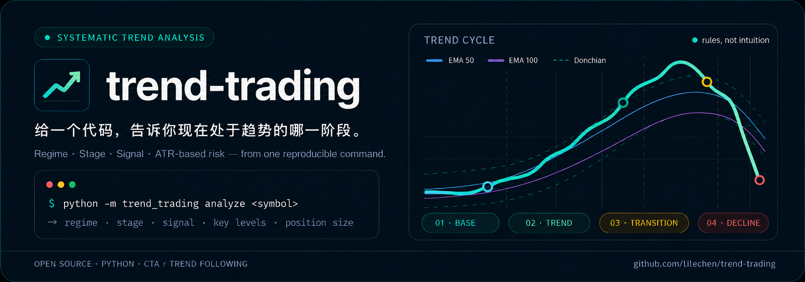

<div align="center">

# trend-trading



**Given a ticker, output where it currently is in its trend cycle.**

A Python toolkit for trend stage analysis. Pulls live market data, runs a documented trading system (currently Clenow CTA), and outputs where the instrument is in its trend cycle right now — with regime, entry/exit levels, ATR-based sizing across 4 risk levels.

[中文](README.md) · [Live Output](#live-output) · [Quick Start](#quick-start) · [Roadmap](#roadmap)

<p>
  <a href="LICENSE"></a>
  <a href="https://github.com/lilechen/trend-trading/stargazers"></a>
  <a href="https://github.com/lilechen/trend-trading/issues"></a>
  <a href="https://github.com/lilechen/trend-trading/commits/main"></a>
  <a href="https://github.com/lilechen/trend-trading"></a>
  <a href="https://github.com/lilechen/research-to-backtest"></a>
</p>

</div>

---

## Table of Contents

- [Background: What is Trend Following?](#background-what-is-trend-following)
- [The Problem](#the-problem)
- [The Solution](#the-solution)
- [Live Output](#live-output)
- [Features](#features)
- [Quick Start](#quick-start)
- [Design Principles](#design-principles)
- [Architecture](#architecture)
- [Supported Systems](#supported-systems)
- [Roadmap](#roadmap)
- [Data Sources & Compliance](#data-sources--compliance)
- [Contributing](#contributing)
- [Testing](#testing)
- [Risk Disclaimer](#risk-disclaimer)
- [Related Projects](#related-projects)
- [License](#license)
- [Disclaimer](#disclaimer)

---

## Background: What is Trend Following?

**Trend Following (a.k.a. CTA — Commodity Trading Advisor)** is a class of systematic trading strategies: identify the medium- to long-term direction of an asset's price, hold in the direction of the trend, exit when the trend reverses. The core creed is **"cut losses short, let winners run"** — the opposite of what most people do instinctively.

### A brief history (simplified)

- **1940s–70s**: Richard Donchian develops moving-average breakout systems, widely considered the father of trend following.
- **1970s**: John W. Henry systematizes trend-following for managed futures, eventually buys the Boston Red Sox; Bill Dunn founds Dunn Capital, peak AUM > $10B.
- **1983**: The Turtle Trading Experiment (Richard Dennis / Bill Eckhardt) proves trend rules **can be taught** — 21 novices with a rule-based system earned $175M in 4 years and launched the modern "systematic trading" mindset.
- **1987–2000**: CTA industry boom; Man Group, AHL (est. 1987), Winton Group become mainstream hedge fund categories.
- **2008**: In the GFC, S&P 500 fell 38% while the SG Trend Index rose 14%+ — the "crisis alpha" of trend following became widely known.
- **2010s–2020s**: Industry grows from ~$300B (2010) to >$400B (2024), but the 2015–2019 trend-less period frustrates many CTAs, leading to multi-strategy / shorter-frequency hybrids.

### Why it works

Researchers (see [research-to-backtest](https://github.com/lilechen/research-to-backtest) `examples/Clenow/`) attribute trend-following's edge to:

1. **Behavioral biases**: investors over-react to short-term news, take profits too early, delay stops — creating **price persistence** rather than mean reversion.
2. **Structured risk management**: fixed-% stops + ATR sizing → many small losses, few large wins. **Long-term positive expectancy** comes from a handful of large trends.
3. **Multi-market diversification**: trading 50–100 contracts across equities / commodities / FX / rates simultaneously hedges single-market blowups.
4. **Crisis alpha**: during equity crashes, trend strategies often catch reverse trends in bonds / FX / commodities.

### Classic books

| Book | Angle |
|---|---|
| Andreas F. Clenow, *Following the Trend* | Engineering of modern CTA trend-following; Ch.4 is what this tool encodes |
| Michael Covel, *Trend Following* | Philosophy and practitioner interviews |
| Robert Carver, *Systematic Trading* | Statistical foundations, vol-targeting position sizing |
| Bill Dunn, *How Markets Work* | CTA practitioner interviews |
| Curtis Faith, *Way of the Turtle* | First-hand Turtle experiment account |
| Stan Weinstein, *Secrets for Profiting in Bull and Bear Markets* | 4-stage + 30-week MA, "retail" view of trends |

### Honest limits

Trend following is **not a holy grail**:
- **Choppy markets = persistent drawdown**: 2015–2019 was 5 years of mediocre-to-negative returns for most CTAs.
- **Whipsaws and false breakouts** are common; discipline is required to sit through them.
- **"Crisis alpha" is not free** — it's the premium paid for surviving choppy years.
- **Scale decay**: strategy capacity is finite; $10B+ funds erode their own edge.

> Clenow provides a 30-year sector attribution + 2002–2021 year-by-year returns table in Ch.5 (see `research-to-backtest/examples/Clenow/Clenow.trading-system.md §13`) — useful as evidence for whether to use this approach.

---

## The Problem

Running a trend-following system (especially CTA-style) has a hidden cost: **every day after close, you scan every position and decide the current stage**.

The rules from the book are clear:
- EMA 50 vs 100 for regime
- Donchian 100-day breakout for entry
- Donchian 50-day reverse for exit
- ATR-based position sizing (0.15% × Equity / ATR20)

But computing these by hand takes ~5 minutes per ticker. 10 holdings = 50 minutes. **Repetitive labor, error-prone, and decision quality suffers from fuzzy memory** ("was EMA100 1300.00 or 1301.50?").

Off-the-shelf tools fall short:
- **Charting software** (TradingView): full-featured but paid, and **doesn't tell you Stage 1/2/3/4**
- **Single-indicator scripts**: you write, maintain, and verify against the book yourself
- **Commercial CTA platforms**: expensive, and the rules are opaque (you don't know what parameters they use)

## The Solution

**`trend-trading` turns "read rules → compute indicators → judge stage" into a one-line CLI.**

```bash
python -m trend_trading analyze 600519
```

It pulls data via akshare / yfinance, runs the full Clenow Ch.4 rule set, and outputs:

| Dimension | What you get |
|---|---|
| **Regime** | trend_up / trend_down / no_trend |
| **Stage** | Stage 1 (bottom reversal) / Stage 2 (trending) / Stage 3 (fading) |
| **Signal** | entry_long / entry_short / exit_long / exit_short / none |
| **Key levels** | 100d high/low, 50d low/high, ATR20, sizing across 4 risk levels |
| **Notes** | Auto warnings: steep slope, over-extension, EMA proximity |

Under 5 seconds end-to-end. Sweep 10 tickers in 1 minute, not 50.

## Live Output

Real run on 600519 (Kweichow Moutai) on 2026-07-10:

```
============================================================
  600519  —  clenow 阶段分析
============================================================
数据截止: 2026-07-10
当前价:   1204.98

[阶段判定]
  阶段:    Stage 2(下降趋势,可做空)
  Regime:  trend_down
  Signal:  exit_long
  建议持仓: short

[关键指标]
  EMA50                       1251.9482
  EMA100                      1300.2888
  EMA50 4周斜率                     -4.93%
  Donchian High (100d)        1526.9800
  Donchian Low (100d)         1168.6300
  Donchian High (50d)         1376.9800
  Donchian Low (50d)          1168.6300
  ATR20                         28.7164
  距 100d 高                      -21.09%
  距 50d 低                        +3.11%

[仓位建议(risk factor 4 档)]
  7.5bp                             2 手
  10bp                              3 手
  15bp (core)                       5 手
  30bp (aggressive)                10 手

[关键价位]
  long_entry_trigger            1526.98
  short_entry_trigger           1168.63
  long_exit_trigger             1168.63
  short_exit_trigger            1376.98

[注意]
  - EMA50 4 周斜率 < -2%,上升趋势走弱,警惕
```

**What this report tells you**:
- Moutai's price is below both EMA50 and EMA100 → regime = down
- It's -21% off the 100d high — has fallen a lot, NOT a buying-the-dip moment
- It's only +3.1% above the 50d low — **close to trigger**: a bit more downside and the system would emit a "go short" signal
- At 15bp risk, a 100k account → 5 contracts

## Features

- **Live data**: A-shares via [akshare](https://akshare.akfamily.xyz/); US / HK / global via [yfinance](https://pypi.org/project/yfinance/)
- **Local parquet cache** (12h TTL) to avoid hammering free APIs
- **Stage detection**: Clenow 4 phases (bottom / trending-up / top / trending-down) translated into Stage 1/2/3/4
- **4 risk levels**: 7.5 / 10 / 15 / 30 bp, matching Clenow Table 4.5
- **Auto warnings**: detects steep slope, over-extension, EMA convergence
- **JSON output**: for scripts, webhooks, email, push
- **Extensible**: add a new system = implement one `analyze(df) → AnalysisResult` method

## Quick Start

### Prerequisites

- Python 3.10+
- `pip install pandas numpy akshare yfinance pyarrow typer`

### Install

```bash
git clone https://github.com/lilechen/trend-trading.git
cd trend-trading
pip install -e ".[dev]"
```

Or minimal:

```bash
pip install -e .
```

### Use

```bash
# Kweichow Moutai (A-share)
python -m trend_trading analyze 600519

# Apple (US, 5 years of data)
python -m trend_trading analyze AAPL --years 5

# Custom risk level and account equity
python -m trend_trading analyze 000001 --risk-bp 10 --equity 500000

# Force-refresh data (ignore cache)
python -m trend_trading analyze 600519 --no-cache

# JSON output (for scripts)
python -m trend_trading analyze 600519 --json
```

`--json` gives you machine-readable output for piping into webhooks, email, or push notifications.

## Design Principles

1. **Rules come from books, not invented.** The current Clenow system maps directly to `research-to-backtest/examples/Clenow/Clenow.system-spec.yaml`; every parameter (EMA 50/100, Donchian 100/50, ATR 20, 4 risk levels) cites the source page. **No "I think it should be this way"**.
2. **Human-trading perspective.** Stage 1/2/3/4, recommended position, warnings — all written for the human in front of the screen, not the backtest engine's array.
3. **Verifiable pure computation.** All indicators are pure pandas / numpy — no "black-box signal service" calls. Every number can be re-derived by hand.
4. **Local-first, API as fallback.** Parquet cache first; akshare/yfinance only on miss; clear errors on failure, no silent fallbacks.
5. **Extensible stage abstraction.** Adding a system = one `TrendSystem` subclass with an `analyze()` method. The CLI flag already supports it.

## Architecture

```
trend-trading/                Python package
├── data/
│   ├── fetcher.py            akshare (A-shares) + yfinance (global) unified
│   └── cache.py              parquet cache, 12h TTL
├── indicators/                Pure computation, no side effects
│   ├── ma.py                 SMA / EMA / EMA slope
│   ├── atr.py                ATR (EMA smoothing, default)
│   ├── donchian.py           rolling max/min + three-weeks-tight
│   └── slope.py              simple / normalized slope
├── systems/                   Rules layer
│   ├── base.py                TrendSystem ABC + AnalysisResult dataclass
│   └── clenow.py             Clenow Ch.4 implementation
├── analysis/                  Reporting layer
│   └── stage.py               analyze() + format_report()
└── cli.py                     typer CLI
```

**Stage abstraction**: every system is a `TrendSystem` subclass implementing `analyze(df) → AnalysisResult`.

```python
class TrendSystem(ABC):
    name: str
    source: str

    @abstractmethod
    def analyze(self, df: pd.DataFrame, code: str = "") -> AnalysisResult: ...
```

Adding Weinstein's stage system = write `WeinsteinSystem(TrendSystem)` with its `analyze()`. The `--system weinstein` CLI flag is already wired.

## Supported Systems

| System | Source | Style | Status |
|---|---|---|---|
| `clenow` | Andreas F. Clenow, *Following the Trend*, Ch.4 | CTA trend-following, symmetric long/short, Donchian | ✅ v0.1 |
| `weinstein` | Stan Weinstein, *Secrets for Profiting in Bull and Bear Markets* | 4-stage, 30-week MA | Planned |
| `oneil-canslim` | William J. O'Neil, *How to Make Money in Stocks* | Growth + 7-factor screen + base patterns | Planned |
| `carver-systematic` | Robert Carver, *Systematic Trading* | EWM vol-targeting, multi-timeframe | Long-term |

Each system's spec lives in [research-to-backtest](https://github.com/lilechen/research-to-backtest) under `examples/<book>/`.

## Roadmap

| Version | Content | Status |
|---|---|---|
| v0.1 | Clenow Ch.4 + akshare/yfinance + CLI | ✅ |
| v0.2 | Weinstein 30-week MA + 4 stages + three-system compare | Planned |
| v0.3 | O'Neil CANSLIM 7-factor + earnings-date avoidance | Planned |
| v0.4 | Watchlist mode (batch-scan N tickers, sort by stage) | Planned |
| v0.5 | Streamlit Web UI + live refresh + charts | Planned |
| v1.0 | YAML spec-driven (read `research-to-backtest`'s `system-spec.yaml` directly) | Planned |
| v1.x | Historical backtest (apply system → compute Sharpe / max DD / win rate) | Planned |
| v2.x | Signal subscription (Telegram / email / push on regime flip) | Planned |

## Data Sources & Compliance

| Source | Coverage | Limits |
|---|---|---|
| [akshare](https://akshare.akfamily.xyz/) | A-shares, HK, futures, funds | Free, may rate-limit (mitigated by local cache) |
| [yfinance](https://pypi.org/project/yfinance/) | US, HK, global indices, FX | Free, known to rate-limit aggressively |
| parquet cache | 12h TTL | All `get_ohlcv` calls prefer local |

**Compliance**:
- This tool is **for personal research and education only**. It does not connect to a broker, does not place orders.
- akshare / yfinance data is **not guaranteed accurate or timely**.
- Commercial use requires a paid data source (JoinQuant / RiceQuant / Wind / Bloomberg).

## Contributing

Issues and PRs welcome.

**Add a new system**:
1. Create `trend_trading/systems/<name>.py`
2. Subclass `TrendSystem`, implement `analyze(df) → AnalysisResult`
3. Add a line in `cli.py` to expose the system flag
4. Add unit tests in `tests/test_<name>.py` (synthetic data, no network)
5. Update the "Supported Systems" table in this README

**Add a new indicator**:
1. Add functions in `trend_trading/indicators/<file>.py`
2. Export from `__init__.py`
3. Add unit tests

**Fix a bug or improve**:
Open a PR. In the issue, describe the bug/improvement + reproduction steps.

## Testing

```bash
pytest tests/                # 17 unit tests, no network
pytest tests/ -v             # verbose
pytest tests/ --cov=trend_trading  # coverage
```

Tests use synthetic OHLCV data (known trend, known regime), no network required. Each `systems/<name>.py` should have a corresponding `tests/test_<name>.py`.

## Risk Disclaimer

**This tool is NOT financial advice, NOT a trading recommendation, and NOT a production trading system.**

- The output reflects "the objective judgment of current data under current rules" — **it does not predict the future**.
- Every trend system fails sometimes: choppy markets, gaps, false breakouts, policy black swans.
- Position sizing, stop losses, and money management are **your** responsibility, not the tool's.
- **Before real trading**: independently backtest the system on historical data, paper-trade it for at least one full bull-bear cycle, and understand why each rule is what it is.
- The authors and contributors are **not liable for any trading loss**.

Read the corresponding spec in [research-to-backtest](https://github.com/lilechen/research-to-backtest) to understand the original method before using the output. Don't treat the tool's output as gospel.

## Related Projects

- **[research-to-backtest](https://github.com/lilechen/research-to-backtest)** — sister project. Extracts trading systems from book / paper PDFs into structured specs (13-section template + operationalization log). The Clenow spec used by this repo was extracted there.

## License

MIT — see [LICENSE](LICENSE).

## Disclaimer

This project is for personal learning, research, and educational purposes only. **It does not constitute investment advice, trading recommendations, or financial opinion.**

- All trading systems, research materials, rules, and code examples referenced in this project come from public literature or open data, used for educational purposes only
- Any analysis output, rule interpretation, or backtest result **does not constitute advice to buy or sell any specific security**
- Real trading involves significant risk, including the potential loss of all principal
- The authors and contributors **are not liable for any direct or indirect losses arising from use of this project**
- Verify all rules and data independently before use, and consult a qualified financial advisor

**Past performance does not guarantee future results. Trading involves risk. Trade at your own risk.**

---

<div align="center">

Made for traders who do the work, not the shortcuts.

</div>