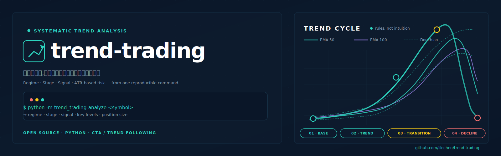

<div align="center">

# trend-trading



**给一个代码,告诉你现在处于趋势的哪一阶段。**

A Python toolkit for trend stage analysis. Pulls live market data, runs a documented trading system (currently Clenow CTA), and outputs where the instrument is in its trend cycle right now — with regime, entry/exit levels, ATR-based sizing across 4 risk levels.

[English](README.en.md) · [示例](#实测输出) · [快速开始](#快速开始) · [路线图](#路线图)

<p>
  <a href="LICENSE"></a>
  <a href="https://github.com/lilechen/trend-trading/stargazers"></a>
  <a href="https://github.com/lilechen/trend-trading/issues"></a>
  <a href="https://github.com/lilechen/trend-trading/commits/main"></a>
  <a href="https://github.com/lilechen/trend-trading/actions"></a>
  <a href="https://github.com/lilechen/research-to-backtest"></a>
</p>

</div>

---

## 目录

- [背景:什么是趋势交易](#背景什么是趋势交易)
- [问题](#问题)
- [解决](#解决)
- [实测输出](#实测输出)
- [特点](#特点)
- [快速开始](#快速开始)
- [设计要点](#设计要点)
- [架构](#架构)
- [支持的交易系统](#支持的交易系统)
- [路线图](#路线图)
- [数据源与合规](#数据源与合规)
- [贡献](#贡献)
- [测试](#测试)
- [风险提示](#风险提示)
- [相关项目](#相关项目)
- [许可证](#许可证)
- [免责声明](#免责声明)

---

## 背景:什么是趋势交易

**趋势跟踪(Trend Following / CTA)** 是一类系统化交易策略:识别资产价格的中长期方向,在趋势方向持仓,趋势反转时平仓。它的核心信条是**"截断亏损、让利润奔跑"(cut losses short, let winners run)**——大多数人反着做。

### 历史脉络(简化)

- **1940s-70s**:理查德·唐奇安(Richard Donchian)开发移动平均突破系统,被视为趋势跟踪之父。
- **1970s**:约翰·W·亨利(John W. Henry)将系统化趋势跟踪商品基金化,后续创办波士顿红袜队;比尔·邓恩(Bill Dunn)创立邓恩资本管理,管理规模峰值超 $10B。
- **1983**:海龟交易实验(Richard Dennis / Bill Eckhardt),证明趋势规则**可教**——一群无经验学员用规则化系统 4 年赚了 $175M,催生「交易可以系统化」的现代观念。
- **1987-2000**:CTA 行业爆发,Man Group、AHL(1987 年起)、Winton Group 等成为主流对冲基金类别。
- **2008**:金融危机中,S&P 500 跌 38% 而 SG Trend Index 涨 14%+,趋势跟踪的「危机 alpha」效应被广泛认知。
- **2010s-2020s**:行业从 $300B(2010)增长到 $400B+(2024),但 2015-2019 长期无趋势期让许多 CTA 表现平淡,行业开始纳入短期/中频策略做混合。

### 为什么它有效

学界(详见 [research-to-backtest](https://github.com/lilechen/research-to-backtest) 的 `examples/Clenow/`)把趋势跟踪的有效性归因于:

1. **行为偏差**:投资者过度反应短期信息、过早锁定利润、延迟止损,造成价格**惯性**而非均值回归。
2. **风险管理结构化**:固定 % 止损 + ATR sizing 让小亏远多于大赢,**长期正期望**靠少数大趋势覆盖。
3. **多市场分散**:同时交易 50-100 个合约(股、商、汇、利),单市场失效被组合对冲。
4. **危机对冲**:股市崩盘时,趋势策略常在其他市场(债、汇、商)捕捉到反向趋势,实现"危机 alpha"。

### 经典著作

| 著作 | 角度 |
|---|---|
| Andreas F. Clenow《Following the Trend》| 现代 CTA 趋势跟踪的工程化拆解,本工具编码的就是 Ch.4 |
| Michael Covel《Trend Following》| 趋势跟踪哲学与名人访谈 |
| Robert Carver《Systematic Trading》| 系统化交易的统计学基础,波动率目标仓位 |
| Bill Dunn《How Markets Work》| CTA 实操访谈 |
| Curtis Faith《Way of the Turtle》| 海龟实验一手记录 |
| Stan Weinstein《Secrets for Profiting in Bull and Bear Markets》| 4 阶段 + 30 周均线,趋势的"散户视角" |

### 趋势跟踪的局限

诚实地说,趋势跟踪**不是圣杯**:
- **横盘市持续亏损**:2015-2019 多数 CTA 经历 5 年低回报甚至小幅回撤。
- **假突破与回撤**:常见,需纪律承受。
- **"危机 alpha" 不免费**:它来自长期横盘市的"保费",不是免费午餐。
- **规模衰减**:策略容量有限,$10B+ 的基金进场会蚕食自己的优势。

> Clenow 在 Ch.5 给了 30 年板块归因 + 2002-2021 逐年收益表(见 `research-to-backtest/examples/Clenow/Clenow.trading-system.md §13`),可作为是否要用这套方法的参考依据。

---

## 问题

做趋势交易(尤其 CTA / 跟随系统)有一个隐藏成本:**每天都要盘后扫一遍所有持仓,判定当前阶段**。

书里写的规则是清楚的:
- 均线多空(EMA 50 vs 100)
- Donchian 突破(100 日新高/低)
- 反向出场(50 日新低/高)
- ATR 波动率仓位(0.15% × Equity / ATR20)

但人工算这些,一只票 5 分钟,持仓 10 只就 50 分钟。**重复劳动,且容易算错**。更糟的是:你看了下茅台在 1200,记得「EMA100 是 1300」,但不记得是 1300.00 还是 1301.50——决策建立在模糊记忆上。

市面上的工具大多是:
- 通用画图软件(TradingView):功能全但要付费,且**不告诉你当前是 Stage 1/2/3/4**
- 单一指标脚本:你得自己写、自己维护、自己对
- 商业 CTA 平台:贵,且规则不透明(不知道用的是什么参数)

## 解决

**`trend-trading` 把"读规则 → 算指标 → 判定阶段"这件事变成一行 CLI。**

```bash
python -m trend_trading analyze 600519
```

它从 akshare / yfinance 拉数据,跑完整的 Clenow Ch.4 规则,输出:

| 维度 | 给你什么 |
|---|---|
| **Regime** | trend_up / trend_down / no_trend |
| **Stage** | Stage 1 (底部反转) / Stage 2 (顺势) / Stage 3 (转弱) |
| **Signal** | entry_long / entry_short / exit_long / exit_short / none |
| **Key levels** | 100 日新高/低、50 日新低/高、ATR20、4 档仓位 |
| **Notes** | 自动警示:斜率过陡、价格过度延伸、EMA 距离过近 |

整个过程 < 5 秒。每天盘后扫 10 只票 = 1 分钟,而不是 50 分钟。

## 实测输出

最近跑茅台(2026-07-10):

```
============================================================
  600519  —  clenow 阶段分析
============================================================
数据截止: 2026-07-10
当前价:   1204.98

[阶段判定]
  阶段:    Stage 2(下降趋势,可做空)
  Regime:  trend_down
  Signal:  exit_long
  建议持仓: short

[关键指标]
  EMA50                       1251.9482
  EMA100                      1300.2888
  EMA50 4周斜率                     -4.93%
  Donchian High (100d)        1526.9800
  Donchian Low (100d)         1168.6300
  Donchian High (50d)         1376.9800
  Donchian Low (50d)          1168.6300
  ATR20                         28.7164
  距 100d 高                      -21.09%
  距 50d 低                        +3.11%

[仓位建议(risk factor 4 档)]
  7.5bp                             2 手
  10bp                              3 手
  15bp (core)                       5 手
  30bp (aggressive)                10 手

[关键价位]
  long_entry_trigger            1526.98
  short_entry_trigger           1168.63
  long_exit_trigger             1168.63
  short_exit_trigger            1376.98

[注意]
  - EMA50 4 周斜率 < -2%,上升趋势走弱,警惕
```

**这段报告告诉你什么**:
- 茅台价格在 EMA50/100 之下 → 趋势判定为 down
- 距离 100 日高点 -21%,已经大跌,不是抄底时机
- 距离 50 日低点只 +3.1%,**接近触发位**——再跌一点点,系统就会给出"做空"信号
- 若按 15bp 风控,账户 10 万对应 5 手仓位

## 特点

- **实时数据**:A 股用 akshare(免费、无需 key),美股/港股用 yfinance
- **本地缓存**:parquet 存储,12h TTL,避免反复打 API 被限流
- **Stage 判定**:Clenow 4 阶段(底部/上升/顶部/下降)直接翻译成 Stage 1/2/3/4
- **4 档仓位**:7.5 / 10 / 15 / 30 bp,匹配 Clenow Table 4.5
- **风险警示**:自动检测斜率过陡、价格过度延伸、EMA 接近等异常
- **JSON 输出**:方便脚本化、推送到 Telegram / 邮件
- **可扩展**:新增系统 = 实现一个 `analyze(df) → AnalysisResult` 方法

## 快速开始

### 前置依赖

- Python 3.10+
- `pip install pandas numpy akshare yfinance pyarrow typer`
- 可选 `pip install typer rich`(rich 用于美化输出)

### 安装

```bash
git clone https://github.com/lilechen/trend-trading.git
cd trend-trading
pip install -e ".[dev]"
```

或最小安装(只装运行时依赖):

```bash
pip install -e .
```

### 使用

```bash
# 茅台(A 股)
python -m trend_trading analyze 600519

# 苹果(美股,5 年数据)
python -m trend_trading analyze AAPL --years 5

# 自定义风控与账户
python -m trend_trading analyze 000001 --risk-bp 10 --equity 500000

# 强制刷新数据(忽略缓存)
python -m trend_trading analyze 600519 --no-cache

# JSON 输出(给脚本用)
python -m trend_trading analyze 600519 --json
```

输出文本格式的同时,`--json` 给你机器可读的结构,方便接 webhook / 邮件 / 推送。

## 设计要点

1. **规则来自书,不是我编的。** 当前 Clenow 系统直接对应 `research-to-backtest/examples/Clenow/Clenow.system-spec.yaml`,参数都标注页码(EMA 50/100, Donchian 100/50, ATR 20, 4 档风控)。**没有"我觉得应该这样"**。
2. **人交易视角。** Stage 1/2/3/4、建议持仓、警示——都是给人看的判断,不是给回测引擎的数组。
3. **可验证的纯计算。** 所有指标都是 pandas / numpy 纯计算,不依赖任何"黑箱信号服务"。每个数字都能手动复核。
4. **本地优先 + API 兜底。** parquet 缓存优先;akshare/yfinance 拿不到时清晰报错,不静默失败。
5. **stage 抽象可扩展。** 新增系统 = 写一个 `TrendSystem` 子类,实现 `analyze()` 方法,无需改其它代码。

## 架构

```
trend-trading/                Python 包
├── data/
│   ├── fetcher.py            akshare (A 股) + yfinance (全球) 统一接口
│   └── cache.py              parquet 缓存,12h TTL
├── indicators/                纯计算,无副作用
│   ├── ma.py                 SMA / EMA / EMA 斜率
│   ├── atr.py                ATR (EMA 平滑,默认)
│   ├── donchian.py           滚动最高/最低 + three-weeks-tight
│   └── slope.py              简单/归一化斜率
├── systems/                   规则层
│   ├── base.py                TrendSystem ABC + AnalysisResult dataclass
│   └── clenow.py             Clenow Ch.4 实现
├── analysis/                  报告层
│   └── stage.py               analyze() + format_report()
└── cli.py                     typer CLI
```

**Stage 抽象**:每个系统是 `TrendSystem` 子类,实现 `analyze(df) → AnalysisResult`。

```python
class TrendSystem(ABC):
    name: str
    source: str

    @abstractmethod
    def analyze(self, df: pd.DataFrame, code: str = "") -> AnalysisResult: ...
```

加 Weinstein stage system = 写一个 `WeinsteinSystem(TrendSystem)`,实现 `analyze()` 即可。`--system weinstein` CLI flag 已经在等。

## 支持的交易系统

| System | 来源 | 风格 | 状态 |
|---|---|---|---|
| `clenow` | Andreas F. Clenow《Following the Trend》Ch.4 | CTA 趋势跟踪 + 多空对称 + Donchian | ✅ v0.1 |
| `weinstein` | Stan Weinstein《Secrets for Profiting in Bull and Bear Markets》 | 4 阶段 + 30 周均线 | ⏳ 计划中 |
| `oneil-canslim` | William J. O'Neil《How to Make Money in Stocks》 | 成长股 + 7 要素筛选 + base pattern | ⏳ 计划中 |
| `carver-systematic` | Robert Carver《Systematic Trading》 | EWM 波动率目标 + 多时间框架 | 💡 远期 |

每个系统的 spec 在 [research-to-backtest](https://github.com/lilechen/research-to-backtest) 的 `examples/<book>/` 下。

## 路线图

| 版本 | 内容 | 状态 |
|---|---|---|
| v0.1 | Clenow Ch.4 + akshare/yfinance + CLI | ✅ |
| v0.2 | Weinstein 30 周均线 + 4 阶段 + 三系统对比模式 | ⏳ |
| v0.3 | O'Neil CANSLIM 7 要素 + 财报日期避让 | ⏳ |
| v0.4 | watchlist 模式(批量扫 N 只,按 stage 排序) | ⏳ |
| v0.5 | Streamlit Web UI + 实时刷新 + 图表 | ⏳ |
| v1.0 | YAML spec 驱动(直接读 research-to-backtest 的 system-spec.yaml,自动出 code) | ⏳ |
| v1.x | 历史回测(应用 system → 算 sharpe / max DD / win rate) | ⏳ |
| v2.x | 信号订阅(Telegram / 邮件 / push,regime 翻转时通知) | ⏳ |

## 数据源与合规

| 源 | 覆盖 | 限制 |
|---|---|---|
| [akshare](https://akshare.akfamily.xyz/) | A 股、港股、期货、基金 | 免费,可能限流,本地缓存缓解 |
| [yfinance](https://pypi.org/project/yfinance/) | 美股、港股、全球指数、外汇 | 免费,已知会激进限流,需重试 |
| parquet 缓存 | 12h TTL | 任何 `get_ohlcv` 调用都优先读本地 |

**合规**:
- 工具**仅供个人研究与教育**,不接券商实盘,不下单
- akshare / yfinance 数据**不保证准确性**与及时性
- 商业使用需换数据源(聚宽 / 米筐 / Wind / Bloomberg)

## 贡献

Issues 和 PR 欢迎。

**加新系统**:
1. 在 `trend_trading/systems/` 下新建 `<name>.py`
2. 继承 `TrendSystem`,实现 `analyze(df) → AnalysisResult`
3. 在 `cli.py` 的 `systems` 列表加一行
4. 在 `tests/` 加单元测试(用合成数据,无需网络)
5. README「支持的交易系统」表加一行

**加新指标**:
1. 在 `trend_trading/indicators/` 加函数文件
2. 在 `__init__.py` 导出
3. 加单元测试

**修 bug / 改进**:
直接开 PR。issue 区描述清楚 bug / 改进 + 复现步骤。

## 测试

```bash
pytest tests/                # 17 单元测试,无需网络
pytest tests/ -v             # 详细输出
pytest tests/ --cov=trend_trading  # 覆盖率
```

测试用合成 OHLCV 数据(已知趋势、已知 regime),不依赖网络。每个 `systems/<name>.py` 都应该有对应的 `tests/test_<name>.py`。

## 风险提示

**本工具不是交易建议,不是投资推荐,不接实盘。**

- 输出反映的是「当前数据 + 当前规则下的客观判定」,**不预测未来**
- 任何趋势系统都会失效——横盘市、跳空、假突破、政策黑天鹅
- 仓位、止损、资金管理是**你**的责任,不是工具的责任
- **真实交易前必须**:独立回测该系统在历史数据的表现、模拟盘验证至少 1 个完整牛熊周期、理解每条规则为何如此
- 作者与贡献者**不对任何交易损失负责**

读完 [research-to-backtest](https://github.com/lilechen/research-to-backtest) 的 example spec,理解原方法后再用,不要把工具输出当圣旨。

## 相关项目

- **[research-to-backtest](https://github.com/lilechen/research-to-backtest)** — 姐妹项目。从交易书 / 论文 PDF 抽取交易系统为结构化 spec(13 节模板 + 操作化日志)。本 repo 的 Clenow 系统 spec 就是从那里提取的。

## 许可证

MIT — 见 [LICENSE](LICENSE)。

## 免责声明

本项目仅供个人学习、研究与教育用途,**不构成任何投资建议、交易推荐或财务意见**。

- 项目涉及的所有交易系统、研究材料、规则与代码示例均来自公开文献或开源数据,仅作学习之用
- 任何分析输出、规则解释或回测结果**不构成对任何具体证券的买卖建议**
- 真实交易涉及重大风险,可能造成全部本金损失
- 项目作者与贡献者**不对任何因使用本项目而产生的直接或间接损失负责**
- 使用前请独立验证所有规则与数据,咨询专业财务顾问

**过去的表现不代表未来的收益。投资有风险,入市需谨慎。**

---

<div align="center">

Made for traders who do the work, not the shortcuts.

</div>